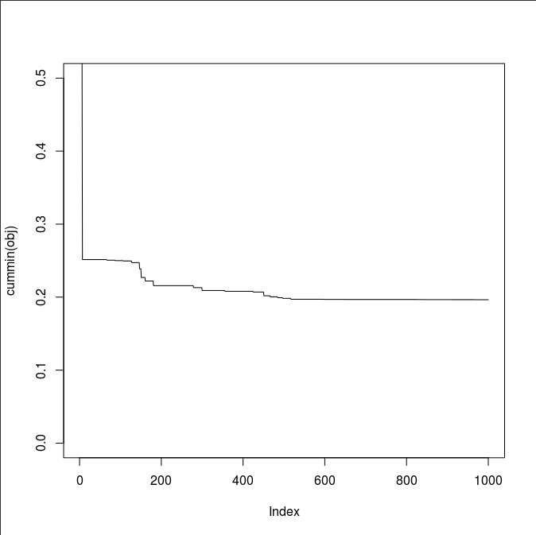
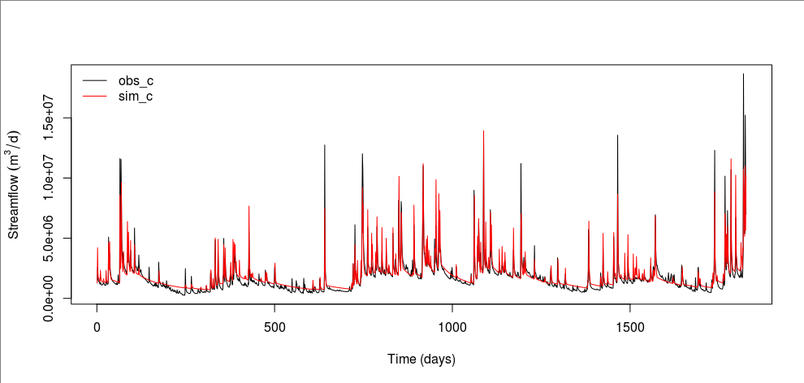
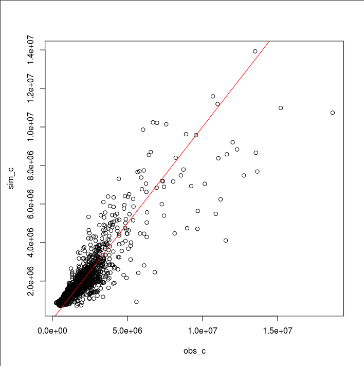
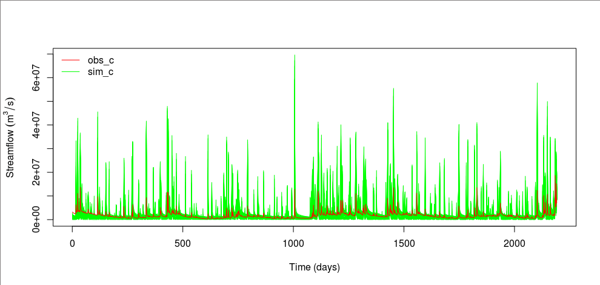

Calibration
===========

Splitting data
--------------

For calibration and validation, we will use data from 2010 to 2015 and 2015 to 2020, respectively.
The first year of each period will be dropped as a warm-up period.
We first need to know how many days are in the calibration period.

.. code-block:: bash

    get_num_days.py 2010-01-01 2015-12-31

Extract the first 2,191 records from input_evap.txt, input_pet.txt, and obs.txt.

.. code-block:: bash

    head -9 input_evap.txt > input_c_evap.txt
    tail +10 input_evap.txt | sed '2191q' >> input_c_evap.txt

    head -9 input_pet.txt > input_c_pet.txt
    tail +10 input_pet.txt | sed '2191q' >> input_c_pet.txt

    head -2 obs.txt > obs_c.txt
    tail +3 obs.txt | sed '2191q' >> obs_c.txt

We will use `input_c_evap.txt <https://github.com/HuidaeCho/foss4g-2021-r.topmodel-workshop/raw/master/data/input_c_evap.txt>`_, `input_c_pet.txt <https://github.com/HuidaeCho/foss4g-2021-r.topmodel-workshop/raw/master/data/input_c_pet.txt>`_, and `obs_c.txt <https://github.com/HuidaeCho/foss4g-2021-r.topmodel-workshop/raw/master/data/obs_c.txt>`_ for calibration.

For validation, we will skip to January 1, 2015.

.. code-block:: bash

    get_num_days.py 2010-01-01 2014-12-31

Skip the first 1,826 records from input_evap.txt, input_pet.txt, and obs.txt.

.. code-block:: bash

    head -9 input_evap.txt > input_v_evap.txt
    tail +1836 input_evap.txt >> input_v_evap.txt

    head -9 input_pet.txt > input_v_pet.txt
    tail +1836 input_pet.txt >> input_v_pet.txt

    head -2 obs.txt > obs_v.txt
    tail +1829 obs.txt >> obs_v.txt

We will use `input_v_evap.txt <https://github.com/HuidaeCho/foss4g-2021-r.topmodel-workshop/raw/master/data/input_v_evap.txt>`_, `input_v_pet.txt <https://github.com/HuidaeCho/foss4g-2021-r.topmodel-workshop/raw/master/data/input_v_pet.txt>`_, and `obs_v.txt <https://github.com/HuidaeCho/foss4g-2021-r.topmodel-workshop/raw/master/data/obs_v.txt>`_ for validation.

Configuration
-------------

Open `config.R <https://github.com/HuidaeCho/foss4g-2021-r.topmodel-workshop/raw/master/data/config.R>`_.

.. code-block:: R

    nruns <- 1000
    skip_c <- 365
    skip_v <- 365
    path_c <- list(params="params.txt",
    	       topidxstats="topidxstats.txt",
    	       input="input_c_pet.txt",
    	       output="output_c.txt",
    	       sim="sim",
    	       obs="obs_c.txt")
    path_v <- list(params="params.txt",
    	       topidxstats="topidxstats.txt",
    	       input="input_v_pet.txt",
    	       output="output_v.txt",
    	       obs="obs_v.txt")
    
    calc_nse <- function(obs, sim, skip=0){
    	if(skip > 0){
    		obs <- obs[-(1:skip)]
    		sim <- sim[-(1:skip)]
    	}
    	1-sum((sim-obs)^2)/sum((mean(obs)-obs)^2)
    }
    
    calc_obj <- function(obs, sim, skip=0){
    	1-calc_nse(obs, sim, skip)
    }

``nruns`` determines how many times to run r.topmodel for calibration.
``skip_c`` and ``skip_v`` are the numbers of time steps for warming up for calibration and validation, respectively.
``path_c`` and ``path_v`` define paths to input and output files for calibration and validation, respectively.
Additionally, it defines a directory where simulation files for calibration will be saved (``sim``) and the location of an observed streamflow file (``obs``).
``calc_nse`` is the Nash-Sutclieffe efficiency (NSE) function.
``calc_obj`` is the objective function for minimization.
Since this objective function returns 1 minus the NSE, its potential minimum value is 0, which means a perfect model.

Parametrization for ISPSO
-------------------------

Like many other optimization algorithms, `ISPSO <https://idea.isnew.info/ispso.html>`_ prefers normalized search spaces to reduce bias in certain parameter dimensions.
The calibrate.R script takes parameter samples from a unit hypercube in :math:`[0,1]^D` where :math:`D` is the number of dimensions or model parameters.
This normalized search space is expanded to the r.topmodel parameter ranges linearly mapping 0 and 1 to the minimum and maximum parameter limits, respectively.

Running calibration
-------------------

Create or empty the sim directory, copy params_init.txt to `params.txt <https://github.com/HuidaeCho/foss4g-2021-r.topmodel-workshop/raw/master/data/params.txt>`_, and run calibrate.R.
For this workshop, we use the Nash-Sutcliffe efficiency (NSE) coefficient as the objective function, but you can change it to another one in config.R.

.. code-block:: bash

    cp params_init.txt params.txt
    mkdir sim
    # or rm sim/*
    ../scripts/calibrate.R

In a separate R session, inspect the declining pattern of the objective function.

.. code-block:: R

    repeat{
        obj <- read.table("sim/obj.txt")[[1]]; plot(cummin(obj), ylim=c(0, 0.5), type="l")
        cat(sprintf("obj=%f, NSE=%f\n", min(obj), 1-min(obj)))
        Sys.sleep(1)
    }

It took me about 2 minutes to populate `the sim directory <https://github.com/HuidaeCho/foss4g-2021-r.topmodel-workshop/raw/master/data/sim>`_.

What is your best NSE ``1-min(obj)``?
I got 0.8035311.
Let's validate this number.

.. code-block:: R

    source("config.R")
    source("../scripts/run_rtopmodel.R")
    source("../scripts/read_write_rtopmodel.R")

    obj <- read.table("sim/obj.txt")[[1]]
    x <- read.table("sim/x.txt")

    best_idx <- which(obj==min(obj))
    best_x <- as.numeric(x[best_idx,])

    obs_c <- read.table("obs_c.txt")[[1]]
    sim_c <- run_rtopmodel_x(best_x, path_c)
    write.table(sim_c, "sim_c.txt", row.names=FALSE, col.names=FALSE)

    calc_nse(obs_c, sim_c, skip_c)

This step will create the final `output_c.txt <https://github.com/HuidaeCho/foss4g-2021-r.topmodel-workshop/raw/master/data/output_c.txt>`_ and `sim_c.txt <https://github.com/HuidaeCho/foss4g-2021-r.topmodel-workshop/raw/master/data/sim_c.txt>`_.

Inspecting the calibration result
---------------------------------

In R, let's compare the observed and best simulated time series.

.. code-block:: R

    old.par <- par(mar=c(5.1, 4.5, 4.1, 2.1))
    plot(obs_c[-(1:skip_c)], type="l", xlab="Time (days)", ylab=expression(Streamflow~(m^3/d)))
    lines(sim_c[-(1:skip_c)], col="red")
    legend("topleft", c("obs_c", "sim_c"), col=c("black", "red"), lty=c(1, 1), bty="n")

    plot(obs_c, sim_c)
    abline(0, 1, col="red")

We can see that the best model tends to overestimate baseflows.
Overall, simulated hydrographs decline at a slower rate than observed ones.
This behavior might be attributed to the use of the NSE as the objective function because the NSE puts more weights on peak flows.
It might be the single-watershed configuration or the infiltration calculation in r.topmodel.
Probably, it might be the structure of TOPMODEL itself that has failed to simulate baseflows.
Let's see if r.topmodel has completely failed to simulate baseflows by plotting all 1,000 simulations.
In the Generalized Likelihood Uncertainty Estimation (GLUE) framework (Beven and Binley, 2014), these simulations from the same model structure are called "models."

.. code-block:: R

    sim_c <- c()
    for(i in 1:1000){
     	file <- sprintf("sim/sim_c_%04d.txt", i)
     	sim_c <- rbind(sim_c, read.table(file)[[1]])
    }

    matplot(t(sim_c), type="l", col="green", lty=1)
    lines(obs_c, col="red")
    legend("topleft", legend=c("obs_c", "sim_c"), col=c("red", "green"), lty=1, bty="n")

From the above plot, the observed streamflow is mostly within the simulated range.
If we consider these "models" from the same model structure of TOPMODEL different models, constructing an ensemble model may be a good idea because no models are perfect and they all come with uncertainty.

References
----------

Beven, K., Binley, A., 2014. GLUE - 20 Years On. Hydrological Processes 28 (24), 5897-5918. :doi:`10.1002/hyp.10082`.
