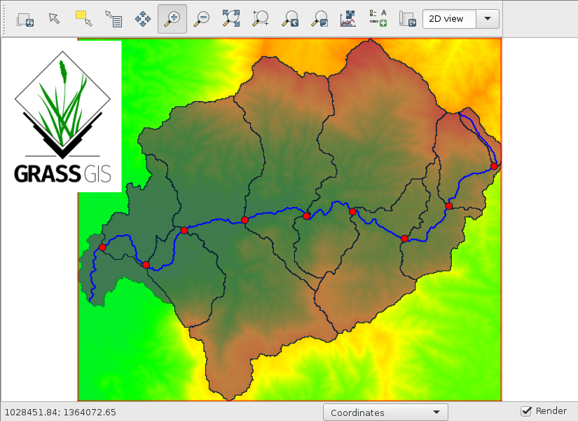

.. toctree::
   :caption: Table of contents
   :hidden:

   introduction
   requirements
   srtm-elevation-data
   watershed
   topographic-index
   r.topmodel-parameters
   ncdc-weather-data
   usgs-streamflow-data

Physically-based hydrologic modeling using GRASS GIS r.topmodel
===============================================================

`FOSS4G 2021 workshop link <https://callforpapers.2021.foss4g.org/foss4g-2021-workshop/talk/7GJNMW/>`_

This workshop will introduce r.topmodel (Cho 2000), the GRASS GIS module for a physically-based hydrologic model called TOPMODEL (Beven 1984).
r.topmodel is a C implementation of the original FORTRAN code by Beven and tightly integrated with GRASS GIS.
We will discuss step-by-step instructions for preparing input data for r.topmodel, running it, calibrating its model parameters, and, finally, post-processing the model outputs.

Abstract
--------

The Topography Model (TOPMODEL) is "a set of conceptual tools that can be used to reproduce the hydrological behaviour of catchments in a distributed or semi-distributed way, in particular the dynamics of surface of subsurface contributing areas" (Beven et al. 1995).
Cho (2000) reimplemented his FORTRAN code as a GRASS GIS module in C, based on which the R package (Buytaert 2009) and SAGA GIS module (Conrad 2003) have been developed (Cho et al. 2019).
Cho (2020) developed r.accumulate, an efficient GRASS GIS hydrologic module for calculating one of its parameters.
We will use these and other modules to create a r.topmodel model and use R scripts including Isolated-Speciation-based Particle Swarm Optimization (ISPSO) (Cho et al. 2011), a particle swarm optimization algorithm in R, to calibrate its parameters.

Authors and affiliations
------------------------

.. image:: images/portrait.png
   :align: left

Huidae Cho, University of North Georgia, United States

Huidae /hidɛ/ is a water resources engineer.
He received his master’s from Kyungpook National University and Ph.D. from Texas A&M University.
He teaches Geospatial Science and Computing at the University of North Georgia.
He is a member of the GRASS GIS Development Team and Project Steering Committee.

Level
-----

Basic. General basic knowledge is required.

Requirements for the attendees
------------------------------

* Basic GIS knowledge is required including coordinate systems, geospatial data formats, etc.
* Basic hydrologic knowledge is required including flow directions, flow accumulation, watershed delineation, etc.
* GRASS GIS 7.8 is required on Linux, macOS, or Windows.
* Digital elevation data (DEM), daily rainfall, evapotranspiration, and streamflow data will be provided.

References
----------

Beven, K., 1984. Infiltration into a Class of Vertically Non-Uniform Soils. Hydrological Sciences Journal 29 (4), 425-434. :doi:`10.1080/02626668409490960`.

Beven, K., Lamb, R., Quinn, P., Romanowicz, R., Freer, J., 1995. TOPMODEL. In: Singh, V.P. (Ed.), Computer Models of Watershed Hydrology. Water Resources Publications, pp. 627-668.

Buytaert, W., 2009. TOPMODEL. https://source.ggy.bris.ac.uk/wiki/Topmodel, accessed on November 9, 2015.

Cho, H., 2000. GIS Hydrological Modeling System by Using Programming Interface of GRASS. Master’s Thesis, Department of Civil Engineering, Kyungpook National University, South Korea.

Cho, H., 2020. A Recursive Algorithm for Calculating the Longest Flow Path and Its Iterative Implementation. Environmental Modelling & Software 131, 104774. :doi:`10.1016/j.envsoft.2020.104774`.

Cho, H., Kim, D., Olivera, F., Guikema, S. D., 2011. Enhanced Speciation in Particle Swarm Optimization for Multi-Modal Problems. European Journal of Operational Research 213 (1), 15-23. :doi:`10.1016/j.ejor.2011.02.026`.

Cho, H., Park, J., Kim, D., 2019. Evaluation of Four GLUE Likelihood Measures and Behavior of Large Parameter Samples in ISPSO-GLUE for TOPMODEL. Water 11 (3), 447. :doi:`10.3390/w11030447`.

Conrad, O., 2003. SAGA-GIS Module Library Documentation (v2.1.3) Module TOPMODEL. http://www.saga-gis.org/saga_module_doc/2.1.3/sim_hydrology_2.html, accessed on November 9, 2015.
