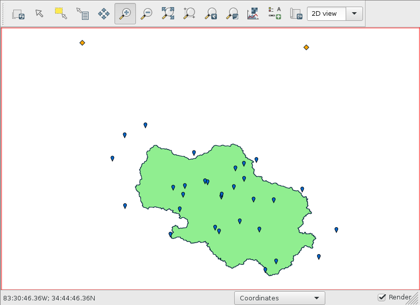
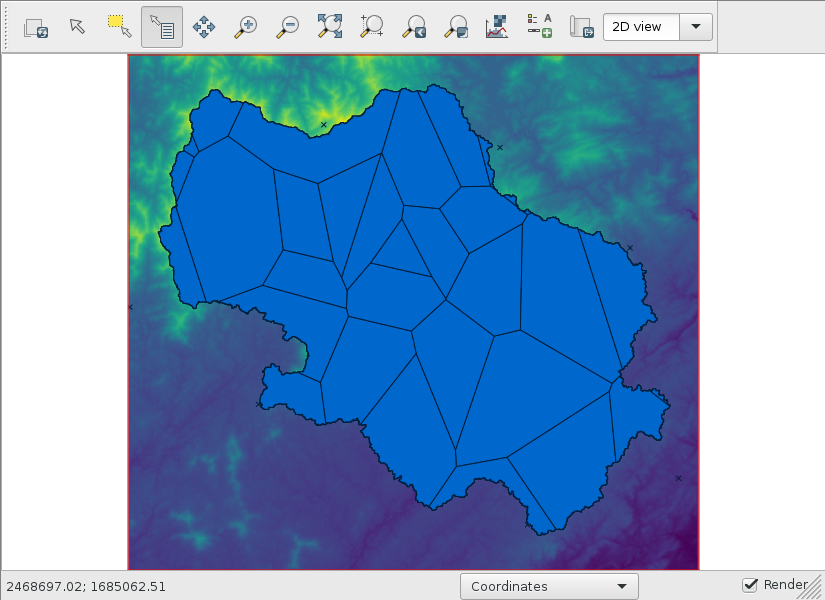

NCDC weather data
=================

Fetching information about weather stations
-------------------------------------------

Download the Global Historical Climatology Network daily (GHCNd) inventory data using `fetch_ghcnd_inventory.py <https://github.com/HuidaeCho/foss4g-2021-r.topmodel-workshop/blob/master/scripts/fetch_ghcnd_inventory.py>`_.
This script will create the ghcnd_inventory table in data.db:

.. code-block:: sql

    CREATE TABLE ghcnd_inventory (
                        cat INTEGER PRIMARY KEY,
                        id VARCHAR(20),
                        latitude REAL,
                        longitude REAL,
                        datatypeid VARCHAR(4),
                        minyear INT,
                        maxyear INT)

We will use this data to check data availability for a certain period of time for simulation.
We need datatypeids of PRCP (precipitation) and EVAP (evaporation).

Using `fetch_ncdc_prcp_stations.py <https://github.com/HuidaeCho/foss4g-2021-r.topmodel-workshop/blob/master/scripts/fetch_ncdc_prcp_stations.py>`_ and `fetch_ncdc_evap_stations.py <https://github.com/HuidaeCho/foss4g-2021-r.topmodel-workshop/blob/master/scripts/fetch_ncdc_evap_stations.py>`_, fetch information about PRCP and EVAP stations from the CDO database.
These two scripts will create the ncdc_prcp_stations and ncdc_evap_stations tables:

.. code-block:: sql

    CREATE TABLE ncdc_prcp_stations (
                        cat INTEGER PRIMARY KEY,
                        id VARCHAR(20),
                        name VARCHAR(100),
                        latitude REAL,
                        longitude REAL,
                        elevation REAL,
                        elevationUnit VARCHAR(10),
                        datacoverage REAL,
                        mindate VARCHAR(10),
                        maxdate VARCHAR(10))

    CREATE TABLE ncdc_evap_stations (
                        cat INTEGER PRIMARY KEY,
                        id VARCHAR(20),
                        name VARCHAR(100),
                        latitude REAL,
                        longitude REAL,
                        elevation REAL,
                        elevationUnit VARCHAR(10),
                        datacoverage REAL,
                        mindate VARCHAR(10),
                        maxdate VARCHAR(10))

Note that the mindate and maxdate columns are not necessarily for PRCP or EVAP data.
Instead, we need to use the minyear and maxyear columns in the ghcnd_inventory table.

Creating weather station vectors
--------------------------------

The coordinates of NCDC weather stations are in latitude and longitude, so we need to create a new latlong location in `EPSG:4326 <https://epsg.io/4326>`_.
Open a new terminal.

.. code-block:: bash

    grass -c epsg:4326 grassdata/epsg4326

Import both ncdc_prcp_stations and ncdc_evap_stations.
We will use data from January 1, 2010 to December 31, 2020.

.. code-block:: bash

    v.in.db table=ncdc_prcp_stations database=data.db x=longitude y=latitude z=elevation key=cat output=ncdc_prcp_stations where="id in (select id from ghcnd_inventory where datatypeid='PRCP' and minyear <= 2010 and maxyear >= 2020)"
    v.in.db table=ncdc_evap_stations database=data.db x=longitude y=latitude z=elevation key=cat output=ncdc_evap_stations where="id in (select id from ghcnd_inventory where datatypeid='EVAP' and minyear <= 2010 and maxyear >= 2020)"

Import the watershed vector from the epsg2240 location.

.. code-block:: bash

    v.proj location=epsg2240 input=watershed

Let's see which weather stations are within or close to the watershed.
Create the Voronoi diagrams of ncdc_prcp_stations and ncdc_evap_stations, and select those stations within the Voronoi polygons.
There are 116,459 points in ncdc_prcp_stations, but calculating their Voronoi polygons should not take long.
It took about 34 seconds on my i5 laptop.

.. code-block:: bash

    v.voronoi input=ncdc_prcp_stations output=ncdc_prcp_stations_voronoi
    v.voronoi input=ncdc_evap_stations output=ncdc_evap_stations_voronoi

    v.select ainput=ncdc_prcp_stations_voronoi binput=watershed output=prcp_stations_voronoi
    v.select ainput=ncdc_evap_stations_voronoi binput=watershed output=evap_stations_voronoi

    v.select ainput=ncdc_prcp_stations binput=prcp_stations_voronoi output=prcp_stations
    v.select ainput=ncdc_evap_stations binput=evap_stations_voronoi output=evap_stations

    # display watershed, prcp_stations, and evap_stations

Blue is prcp_stations and orange is evap_stations.

Now, go back to the epsg2240 terminal and import these selected stations.

.. code-block:: bash

    v.proj location=epsg4326 input=prcp_stations_voronoi
    v.proj location=epsg4326 input=evap_stations_voronoi
    v.proj location=epsg4326 input=prcp_stations
    v.proj location=epsg4326 input=evap_stations

Clip the Voronoi vectors to the watershed.

.. code-block:: bash

    v.clip input=prcp_stations_voronoi clip=watershed output=prcp_stations_voronoi_watershed
    v.clip input=evap_stations_voronoi clip=watershed output=evap_stations_voronoi_watershed
    # display prcp_stations_voronoi_watershed

Downloading weather data
------------------------

.. code-block:: bash

    tmod.ncdc prcp_voronoi=prcp_stations_voronoi_watershed evap_voronoi=evap_stations_voronoi_watershed start_date=2010-01-01 end_date=2020-12-31 output=input.txt
