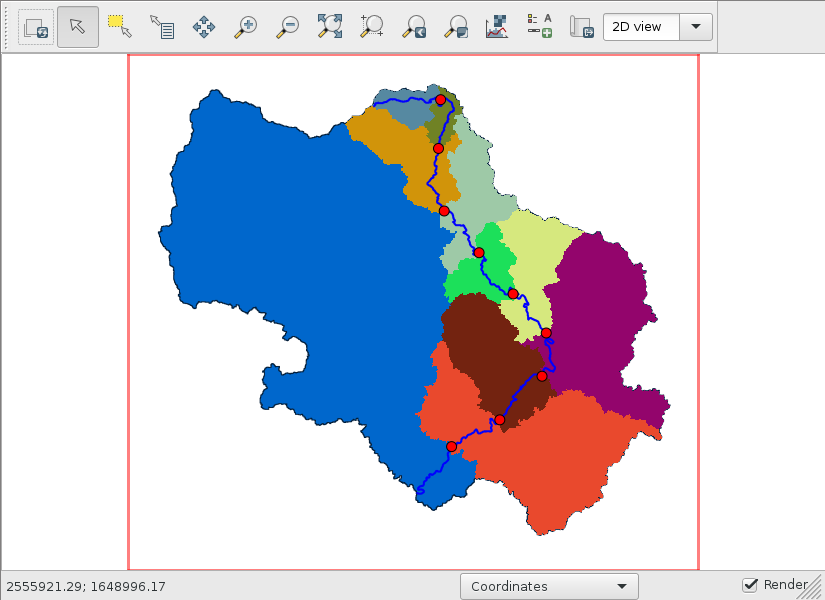
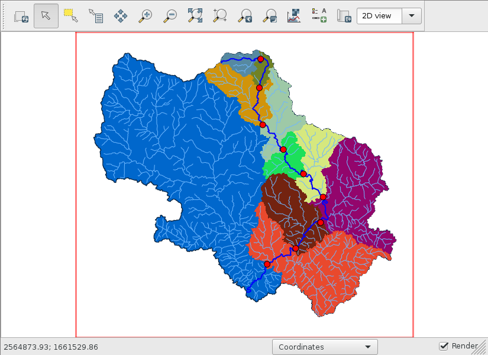

r.topmodel parameters
=====================

`r.topmodel <https://grass.osgeo.org/grass78/manuals/r.topmodel.html>`_ requires the following three input files:

* parameters: TOPMODEL parameters passed to ``r.topmodel parameters=``
* topidxstats: topographic index statistics passed to ``r.topmodel topidxstats=``
* input: rainfall and potential evapotranspiration time series passed to ``r.topmodel input=``

This split design allows the modeler to use the same parameters file for different scenarios of topographic index or weather forcing data.

Parameters file structure
-------------------------

The following is an example of the r.topmodel parameters file:

.. code-block::

    # Subwatershed name
    Subwatershed 1

    ################################################################################
    # A [m^2]: Total subwatershed area
    3.31697E+07

    ################################################################################
    # qs0 [m/h]: Initial subsurface flow per unit area
    #            "The first streamflow input is assumed to represent
    #             only the subsurface flow contribution in the watershed."
    #                                                        - Liaw (1988)
    0.000075

    # lnTe [ln(m^2/h)]: Areal average of ln(T0)
    4

    # m [m]: Scaling parameter
    0.0125

    # Sr0 [m]: Initial root zone storage deficit
    0.0025

    # Srmax [m]: Maximum root zone storage deficit
    0.04

    # td [h]: Unsaturated zone time delay per unit storage deficit if greater than 0
    #  OR
    # -alpha: Effective vertical hydraulic gradient if not greater than 0.
    #
    # For example, -10 means alpha=10.
    20

    # vch [m/h]: Main channel routing velocity
    1000

    # vr [m/h]: Internal subwatershed routing velocity
    1000

    ################################################################################
    # infex: Calculate infiltration excess if not zero (integer)
    1

    # K0 [m/h]: Surface hydraulic conductivity
    2

    # psi [m]: Wetting front suction
    0.1

    # dtheta: Water content change across the wetting front
    0.1

    ################################################################################
    # d [m]: Distance from the watershed outlet
    #           The first value should be the mainstream distance from
    #           the subwatershed outlet to the watershed outlet.
    # Ad_r:  Cumulative area ratio of subwatershed (0.0 to 1.0)
    #           The first and last values should be 0 and 1, respectively.

    #   d  Ad_r
        0   0.0
     1000   0.2
     2000   0.4
     3000   0.6
     4000   0.8
     5000   1.0

When it reads any input files, r.topmodel ignores empty lines or comments starting with a ``#``.
The above example can be written without comments like this:

.. code-block::

    Subwatershed 1
    3.31697E+07
    0.000075
    4
    0.0125
    0.0025
    0.04
    20
    1000
    1000
    1
    2
    0.1
    0.1
        0   0.0
     1000   0.2
     2000   0.4
     3000   0.6
     4000   0.8
     5000   1.0

All lengths and times in any input files must be given in meters and hours for consistency except for ``R`` (rainfall) and ``Ep`` (potential evapotranspiration) in the ``input=`` file, which are in per ``dt``, a number of hours.

Parameter ranges
----------------

.. list-table:: r.topmodel parameters and their ranges
   :widths: 10 70 10 10
   :header-rows: 1

   * - Name
     - Description
     - Min
     - Max
   * - qs0
     - Initial subsurface flow per unit area in m/h
     - 0
     - 0.0001
   * - lnTe
     - Areal average of the soil surface transimissivity in ln(m\ :sub:`2`/h)
     - -7
     - 10
   * - m
     - Scaling parameter describing the soil transimissivity in m
     - 0.001
     - 0.25
   * - Sr0
     - Initial root zone storage deficit in m
     - 0
     - 0.01
   * - Srmax
     - Maximum root zone storage deficit in m
     - 0.005
     - 0.08
   * - td
     - Unsaturated zone time delay per unit storage deficit in h
     - 0.001
     - 40
   * - vch
     - Main channel routing velocity in m/h; not to be calibrated
     - 50
     - 2000
   * - vr
     - Internal subwatershed routing velocity in m/h
     - 50
     - 2000
   * - K0
     - Surface hydraulic conductivity in m/h
     - 0.0001
     - 0.2
   * - psi
     - Wetting front suction in m
     - 0.01
     - 0.5
   * - dtheta
     - Water content change across the wetting front
     - 0.01
     - 0.6

Multi-subwatershed models
-------------------------

One can split a watershed into multiple subwatersheds, each of which can be modeled by a separate r.topmodel model.
Then, hydrographs from multiple r.topmodel models can be combined to simulate the watershed of interest.
This configuration for multiple subwatersheds can be achieved by adding the main channel distance from the watershed outlet to the outlet of each subwatershed to distances for the cumulative area ratios at the end of each parameters file.
In this workshop, we will model the watershed as a single watershed as is for simplicity and ignore the main channel routing.

Our watershed parameters
------------------------

The first line is the name of the watershed, so let's use the name of the USGS gauge "USGS 02331600 Chattahoochee River near Cornelia, GA".

The second line ``A`` is the watershed area in m\ :sup:`2`, which can be obtained by the following command:

.. code-block:: bash

    r.stats -an watershed

The watershed area is 820,402,112.739749 m\ :sup:`2`.

The third line is :math:`q_{s0}`, the initial subsurface flow per unit area in m/h.
Unfortunately, we do not have a priori knowledge about this parameter either or both because it is hard to measure practically or we just do not have enough time during this workshop for better research about it for our watershed.
Since we will calibrate this parameter, let's use 0.000075 m/h for now.
However, if you have better information about it for your watershed, you can use that.
For this workshop, we will calibrate most non-topological parameters that cannot easily be computed in GIS.

The fourth line is :math:`\ln(T_e)`, the areal average of :math:`\ln(T_0)` in ln(m\ :sup:`2`/h) where :math:`T_0` is the lateral transmissivity at the soil surface.
Let's use 4 ln(m\ :sup:`2`/h) for now.
We will calibrate this parameter.

The fifth line is :math:`m`, the soil transmissivity scaling parameter in m.
This parameter along with :math:`T_0` and :math:`S_i`, the storage deficit at point :math:`i`, is used to estimate the downslope transmissivity :math:`T=T_0\exp{-\frac{S_i}{m}}`.
We will use 0.0125 m and calibrate it later.

The sixth line is :math:`S_{r0}`, the initial root zone storage deficit in m.
We will use 0.0025 m for the initial model.

The seventh line is :math:`S_{r,\text{max}}`, the maximum root zone storage deficit in m.
Use 0.04 m for the initial model.

The eighth line is :math:`t_d`, the unsaturated zone time delay per unit storage deficit in h.
Use 20 h for the initial model.

The ninth line is :math:`v_\text{ch}`, the main channel routing velocity in m/h.
This parameter is effective only if the distance for the first cumulative area ratio of the subwatershed is not zero because the main channel is assumed to start at the outlet of the subwatershed.
We set it to 1000 m/h.

The 10th line is :math:`v_r`, the internal subwatershed routing velocity in m/h.
This routing velocity is used within the subwatershed until flow reaches its outlet or the starting point of the main channel in a bigger configuration for a multi-subwatersheds (multi-r.topmodel) model.
We start from 1000 m/h.

The 11th line is infex, the flag for calculating infiltration excess.
We will calculate infiltration excess by setting it to 1.

The 12th line is :math:`K_0`, the surface hydraulic conductivity in m/h.
We use 2 m/h for the initial model.

The 13th line is :math:`\psi`, the wetting front suction in m.
Use 0.1 m to start calibration.

The 14th line is :math:`d\theta`, the water content change across the wetting front.
Use 0.1 for the initial model.

The last section of the parameters file is based on topography, which is not to be calibrated.
Each line consists of two columns with :math:`d`, the distance from the watershed outlet to the subwatershed outlet in m, followed by :math:`A_\text{d,r}`, the cumulative area ratio of the subwatershed at that distance.
:math:`A_\text{d,r}` is the contribution area between the subwatershed outlet and at that distance, so it must start with 0 and end with 1.

Variable contributing areas
---------------------------

For this workshop, let's create 10 variable contributing areas within the watershed at an equidistant interval.
Since we can use 0 and 0 for the first pair of :math:`d` and :math:`A_\text{d,r}`, and the full longest flow length and 1 for the last pair, we only need to create 9 points.
Create a file called suboutlets.txt with the following content:

.. code-block::

    P 1 1 -10%
    P 2 1 -20%
    P 3 1 -30%
    P 4 1 -40%
    P 5 1 -50%
    P 6 1 -60%
    P 7 1 -70%
    P 8 1 -80%
    P 9 1 -90%

``P 2 1 -20%`` means that we want to create a suboutlet point at the 20% distance from the end node of the category 1 line and assign category 2 to the new point.

.. code-block:: bash

    v.segment input=lfp rules=suboutlets.txt output=suboutlets
    r.accumulate direction=fdir outlet=suboutlets subwatershed=subwatersheds
    # display subwatersheds and suboutlets

I know what you think.
The blue area on the left side of the watershed does not drain into any of the nine suboutlets, but its size is almost half.
This watershed really has two major subwatersheds near its outlet and the longest flow path (blue line) happens to be in just one major subwatershed.
This figure overlays the streams vector.

In this case, it is advisable to create a multi-subwatershed model with two separate r.topmodel models.
However, we will finish this single watershed case anyway.

.. code-block:: bash

    v.db.addtable map=lfp
    v.to.db map=lfp option=length units=meters columns=length_m
    v.db.select map=lfp

The longest flow length is 66,110.118521 m.
For each of 10 variable contributing areas, a distance of 6,611.0118521 m is accumulated.

.. code-block:: bash

    v.db.addtable map=suboutlets
    v.db.addcolumn map=suboutlets columns="distance_m real"
    v.db.update map=suboutlets column=distance_m query_column="cat*6611.0118521"

The cumulative area ratios of 10 subwatersheds can be obtained from the flow accumulation raster.

.. code-block:: bash

    v.what.rast map=suboutlets raster=facc column=facc
    v.what.rast map=outlet raster=facc column=facc
    v.db.select map=outlet

The total number of cells within the watershed is 1,058,540.
Divide the facc column in the suboutlets vector by this number to obtain the cumulative area ratios.

.. code-block:: bash

    v.db.addcolumn map=suboutlets columns="area_ratio real"
    v.db.update map=suboutlets column=area_ratio query_column="1-facc/1058540."
    v.db.select -c suboutlets columns=distance_m,area_ratio separator=tab

Just make sure to append a ``.`` after 1058540 to force a floating-point division.
This is my output:

.. code-block::

    6611.0118521    0.508024259829577
    13222.0237042   0.645446558467323
    19833.0355563   0.710716647457819
    26444.0474084   0.822589604549663
    33055.0592605   0.867452340015493
    39666.0711126   0.892391407032328
    46277.0829647   0.934296294896745
    52888.0948168   0.976866249740208
    59499.1066689   0.986551287622574

Prepend ``0.0 0.0`` and append ``66110.118521 1.0`` to complete the last section of the parameters file.

Our parameters file
-------------------

This is my params_init.txt.

.. code-block::

    # Subwatershed name
    USGS 02331600 Chattahoochee River near Cornelia, GA

    ################################################################################
    # A [m^2]: Total subwatershed area
    820402112.739749

    ################################################################################
    # qs0 [m/h]: Initial subsurface flow per unit area
    #            "The first streamflow input is assumed to represent
    #             only the subsurface flow contribution in the watershed."
    #                                                        - Liaw (1988)
    0.000075

    # lnTe [ln(m^2/h)]: Areal average of ln(T0)
    4

    # m [m]: Scaling parameter
    0.0125

    # Sr0 [m]: Initial root zone storage deficit
    0.0025

    # Srmax [m]: Maximum root zone storage deficit
    0.04

    # td [h]: Unsaturated zone time delay per unit storage deficit if greater than 0
    #  OR
    # -alpha: Effective vertical hydraulic gradient if not greater than 0.
    #
    # For example, -10 means alpha=10.
    20

    # vch [m/h]: Main channel routing velocity
    1000

    # vr [m/h]: Internal subwatershed routing velocity
    1000

    ################################################################################
    # infex: Calculate infiltration excess if not zero (integer)
    1

    # K0 [m/h]: Surface hydraulic conductivity
    2

    # psi [m]: Wetting front suction
    0.1

    # dtheta: Water content change across the wetting front
    0.1

    ################################################################################
    # d [m]: Distance from the watershed outlet
    #           The first value should be the mainstream distance from
    #           the subwatershed outlet to the watershed outlet.
    # Ad_r:  Cumulative area ratio of subwatershed (0.0 to 1.0)
    #           The first and last values should be 0 and 1, respectively.

    #   d  Ad_r
    0.0             0.0
    6611.0118521    0.508024259829577
    13222.0237042   0.645446558467323
    19833.0355563   0.710716647457819
    26444.0474084   0.822589604549663
    33055.0592605   0.867452340015493
    39666.0711126   0.892391407032328
    46277.0829647   0.934296294896745
    52888.0948168   0.976866249740208
    59499.1066689   0.986551287622574
    66110.118521    1.0
