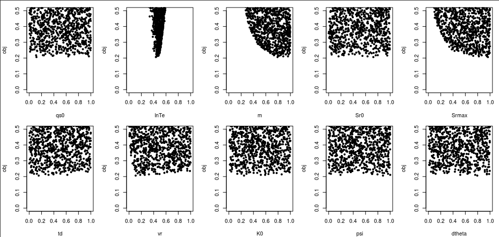
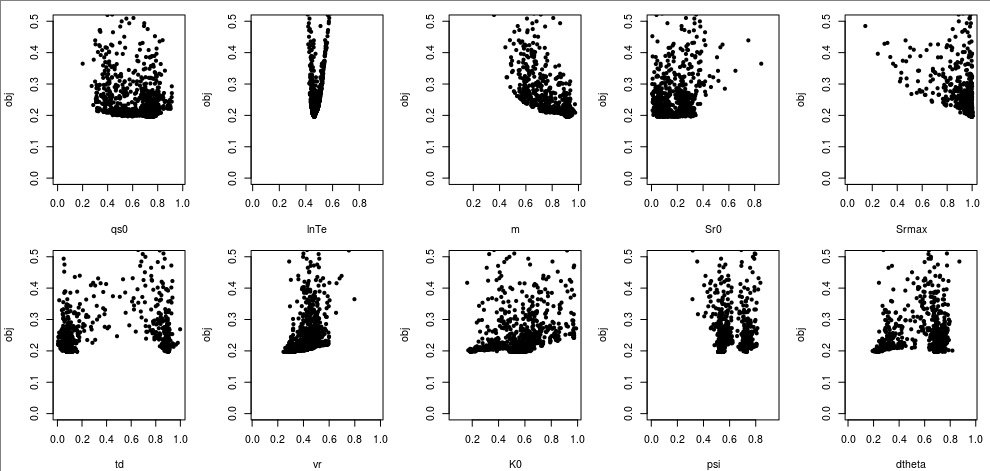

Random parameter sampling
=========================

Running r.topmodel with random parameter values
-----------------------------------------------

Without a priori knowledge about their distributions, we can assume that they follow a uniform distribution.
If you want to take random parameter samples for Bayesian analysis under this assumption, you can use config_random.R and sample_random.R.
This command will run r.topmodel 10,000 times and took about 20 minutes on my laptop, so you may just want to copy the `sim_random <https://github.com/HuidaeCho/foss4g-2021-r.topmodel-workshop/raw/master/data/sim_random>`_ directory to run/sim_random and skip to the next step for now.

.. code-block:: bash

    mkdir sim_random
    ../scripts/sample_random.R

Performance comparison of calibration and random sampling
---------------------------------------------------------

In R, let's calculate the minimum objective function value.

.. code-block:: R

    obj_random <- read.table("sim_random/obj.txt")[[1]]
    print(1-min(obj_random))

From this random sampling, I found an NSE of 0.7937873, which is slightly lower than 0.8035311 from our calibration.
We can compare the performance of calibration and random sampling up to 1,000 runs if that matters.

.. code-block:: R

    obj <- read.table("sim/obj.txt")[[1]]

    old.par <- par(mfrow=c(1,1), mar=c(5.1, 4.5, 4.1, 2.1))
    plot(cummin(obj), ylim=c(0, 0.5), type="l", xlab="Model runs")
    lines(cummin(obj_random[1:1000]), col="red")

Sensitivity analysis
--------------------

Plot x-obj dotty plots to see how sensitive the objective function is to each parameter.

.. code-block:: R

    source("../scripts/run_rtopmodel.R")

    x_random <- read.table("sim_random/x.txt")

    old.par <- par(mfrow=c(2,5), mar=c(4.1, 4.1, 1.1, 1.1))
    for(i in 1:10) plot(x_random[,i], obj_random, ylim=c(0,0.5), xlab=par.name[i], pch=20)

From these dotty plots, we can see that lnTe, m, and Srmax are sensitive parameters.

Let's create a similar plot using the calibration result.

.. code-block:: R

    x <- read.table("sim/x.txt")
    for(i in 1:10) plot(x[,i], obj, ylim=c(0,0.5), xlab=par.name[i], pch=20)

