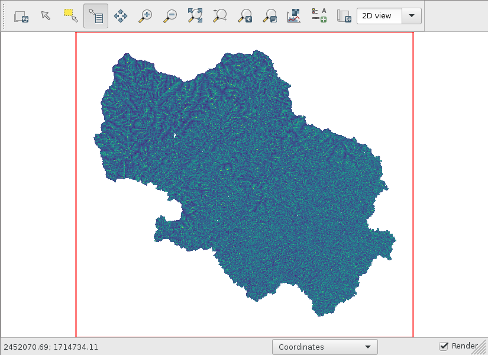

Topographic index
=================

Warning
-------
It is important to use the native resolution of the DEM when we calculate topographic index rasters because `r.topidx <https://grass.osgeo.org/grass78/manuals/r.topidx.html>`_ uses neighbor cell values to termine the local surface topographic slope.
See `this article <https://idea.isnew.info/r.topidx.html>`_ for more information.
If you did not deviate from my instructions, you should already be in the correct resolution.
Otherwise, run this command to set the correct region and resolution using the dem_burned raster.

.. code-block:: bash

    g.region raster=dem_burned

Calculating the topographic index
---------------------------------

Calculating the topographic index just takes one command.
Then, clip it to the dem_burned raster.

.. code-block:: bash

    r.topidx input=dem_burned output=topidx
    r.mapcalc expression="topidx_watershed=if(isnull(watershed),null(),topidx)"
    # display topidx_watershed

