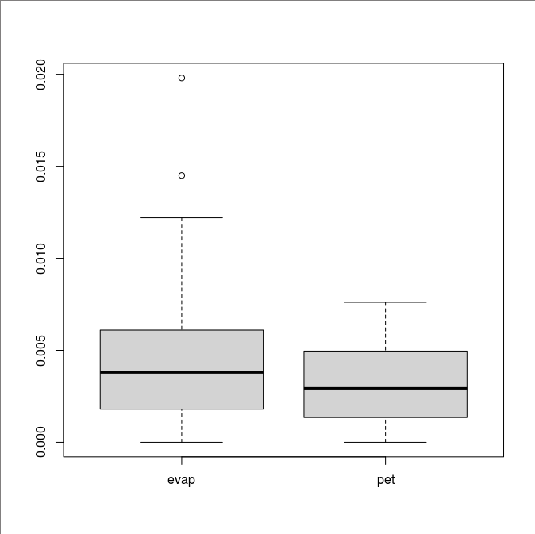
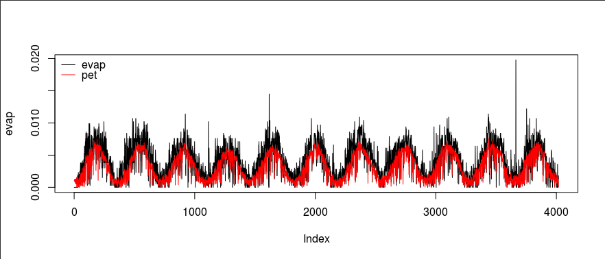

USGS potential evapotranspiration data
======================================

`The USGS daily global potential evapotranspiration (PET) <https://earlywarning.usgs.gov/fews/product/81>`_ is estimated using climate parameters extracted from the Global Data Assimilation System (GDAS), which is run every six hours by `the National Oceanic and Atmospheric Administration (NOAA) <https://www.noaa.gov/>`_.
Its data resolution is 1° by 1°.
The data availability is from January 1, 2001.
However, its web interface is limited to a single-year, single-month, or single-day download.
The unit of this data product is 0.01 mm, which means a cell value of 1 indicates a daily potential evapotranspiration of 0.01 mm.

Downloading PET data
--------------------

Direct downloads are available from

* `daily directory <https://edcintl.cr.usgs.gov/downloads/sciweb1/shared/fews/web/global/daily/pet/downloads/daily/>`_,
* `monthly directory <https://edcintl.cr.usgs.gov/downloads/sciweb1/shared/fews/web/global/daily/pet/downloads/monthly/>`_, and
* `yearly directory <https://edcintl.cr.usgs.gov/downloads/sciweb1/shared/fews/web/global/daily/pet/downloads/yearly/>`_.

Using `fetch_usgs_pet.py <https://github.com/HuidaeCho/foss4g-2021-r.topmodel-workshop/blob/master/scripts/fetch_usgs_pet.py>`_, download PET data.

.. code-block:: bash

    fetch_usgs_pet.py 2010-01-01 2020-12-31

Extracting data for the watershed
---------------------------------

From the epsg4326 location, import all the files using `import_usgs_pet.sh <https://github.com/HuidaeCho/foss4g-2021-r.topmodel-workshop/blob/master/scripts/import_usgs_pet.sh>`_.

Find the centroid of the watershed.

.. code-block:: bash

    v.to.db map=watershed option=coor columns=x,y
    v.to.db map=watershed option=area columns=area_km2 units=kilometers
    v.db.select map=watershed

The major centroid is at -83.6274554161366,34.6959628598932.

.. code-block:: bash

    for i in $(g.list type=raster pattern=et*); do
        r.what map=$i coordinates=-83.6274554161366,34.6959628598932 | sed 's/.*|/0.00001*/' | bc
    done > usgs_pet.txt

Creating input files
--------------------

Replace NCDC EVAP data in input_evap.txt with this data and create a new input_pet.txt file.

.. code-block:: bash

    head -9 input_evap.txt > input_pet.txt
    tail +10 input_evap.txt | sed 's/ .*//' > ncdc_prcp.txt
    tail +10 input_evap.txt | sed 's/.* //' > ncdc_evap.txt
    paste ncdc_prcp.txt usgs_pet.txt >> input_pet.txt

Comparing EVAP and PET data
---------------------------

In R, let's compare EVAP and PET data.

.. code-block:: R

    evap <- read.table("ncdc_evap.txt")[[1]]
    pet <- read.table("usgs_pet.txt")[[1]]
    boxplot(data.frame(evap, pet))

    plot(evap, type="l")
    lines(pet, col="red")
    legend("topleft", legend=c("evap", "pet"), lty=c(1, 1), col=c("black", "red"), bty="n")

Overall, EVAP data is greater than PET data.
