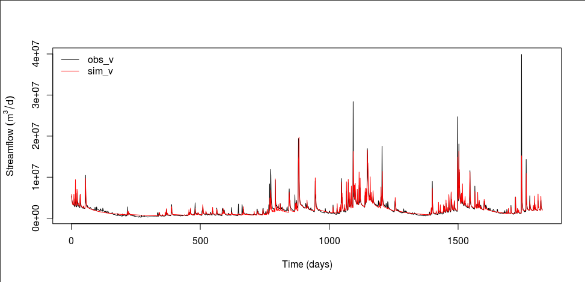

Validation
==========

Validating the calibrated model
-------------------------------

In R, let's validate our calibrated model using data from 2015 to 2020.

.. code-block:: R

    obs_v <- read.table("obs_v.txt")[[1]]
    sim_v <- run_rtopmodel(path_v)
    write.table(sim_v, "sim_v.txt", row.names=FALSE, col.names=FALSE)

    calc_nse(obs_v, sim_v, skip_v)

This step will create `output_v.txt <https://github.com/HuidaeCho/foss4g-2021-r.topmodel-workshop/raw/master/data/output_v.txt>`_ and `sim_v.txt <https://github.com/HuidaeCho/foss4g-2021-r.topmodel-workshop/raw/master/data/sim_v.txt>`_.

My NSE for validation is 0.7745305, which is not bad.
However, baseflows are still not properly simulated.

