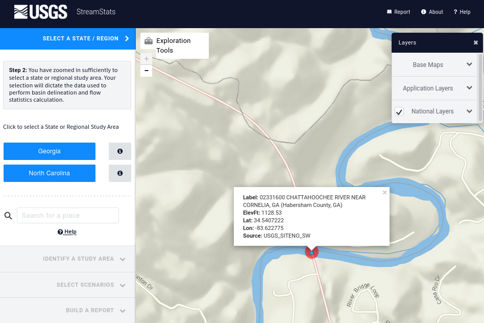
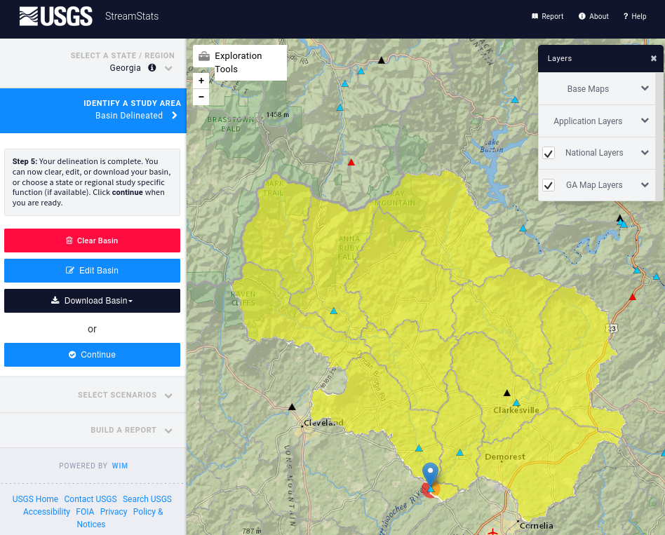
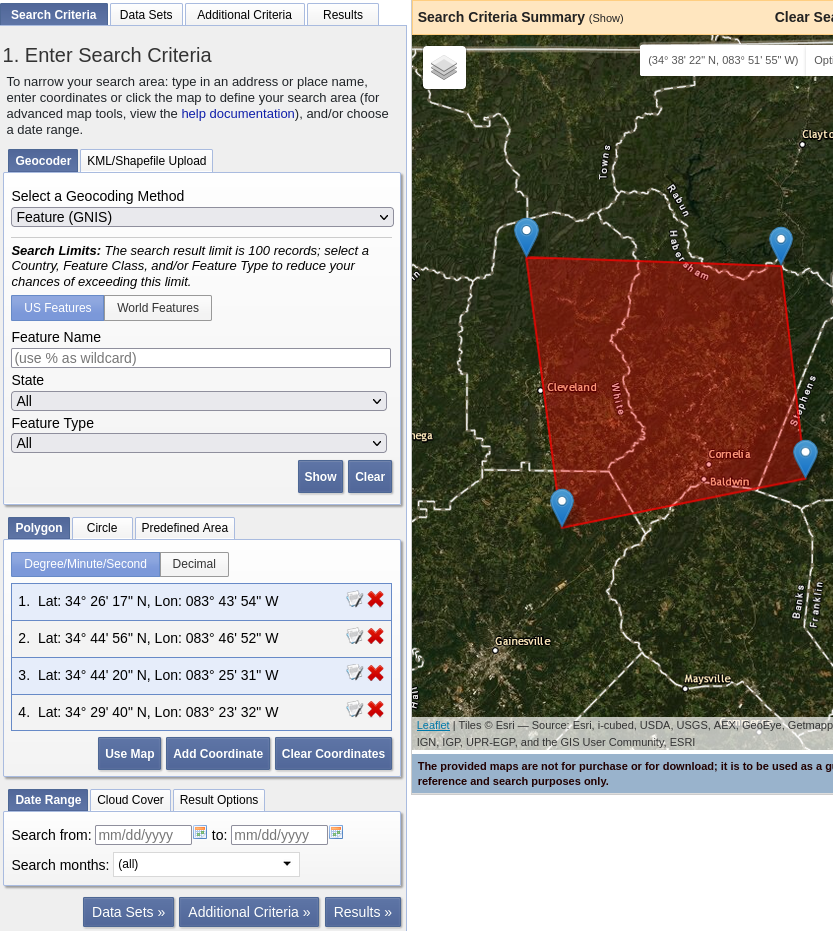
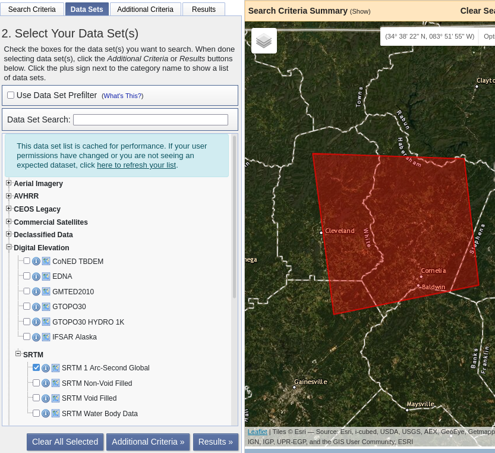
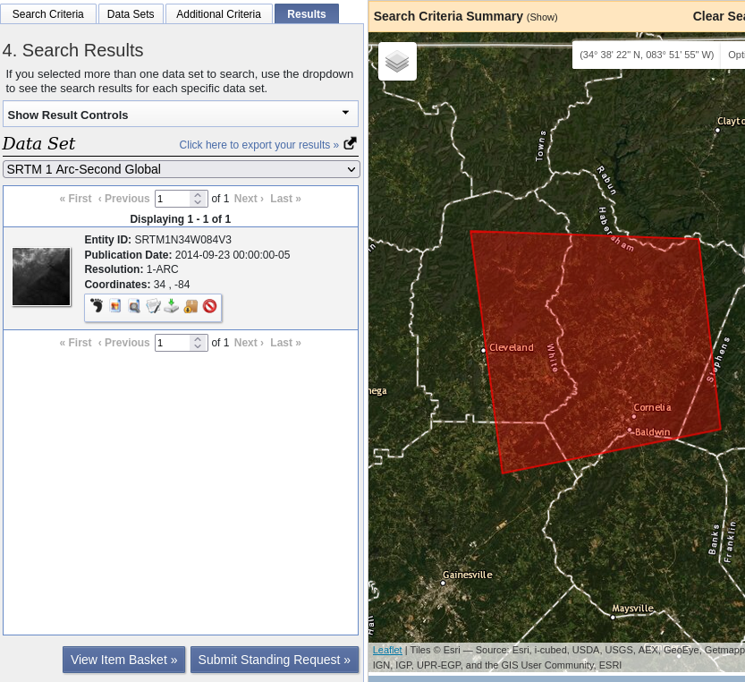

Watershed delineation
=====================

Streamflow gauge
----------------

For this workshop, we need to find a watershed that has a streamflow gauge at its outlet for calibration purposes.
Go to `StreamStats <https://streamstats.usgs.gov/ss/>`_ and search for ``02331600``, which is the name of a United States Geological Survey (USGS) streamflow gauge.

Select "Georgia" and delineate a watershed at just the downstream cell of the gauge.
Optionally, download `the watershed Shapefile <https://github.com/HuidaeCho/foss4g-2021-r.topmodel-workshop/raw/master/outputs/streamstats_02331600_watershed.zip>`_.

SRTM DEM from EarthExplorer
---------------------------

Go to `EarthExplorer <https://earthexplorer.usgs.gov/>`_ and zoom to the area of the watershed above.
Draw a polygon that entirely covers the watershed.

We will use the `SRTM DEM <https://www2.jpl.nasa.gov/srtm/>`_.
Click "Data Sets" and search for "SRTM 1 arc-second".

Click "Results" and download `the GeoTIFF file <https://github.com/HuidaeCho/foss4g-2021-r.topmodel-workshop/raw/master/outputs/n34_w084_1arc_v3.tif>`_.

.. image:: projpicker.png
   :align: center
   :width: 75%
