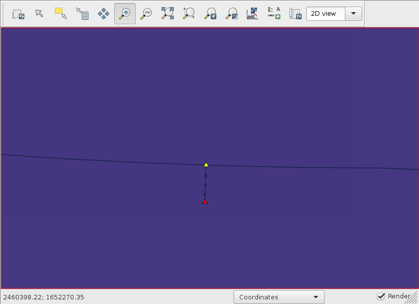

Watershed delineation
=====================

Let's check the coordinate reference system (CRS) of the DEM.

.. code-block:: bash

    gdalsrsinfo n34_w084_1arc_v3.tif

This is my output.

.. code-block::

    PROJ.4 : +proj=longlat +datum=WGS84 +no_defs

    OGC WKT2:2018 :
    GEOGCRS["WGS 84",
        DATUM["World Geodetic System 1984",
            ELLIPSOID["WGS 84",6378137,298.257223563,
                LENGTHUNIT["metre",1]]],
        PRIMEM["Greenwich",0,
            ANGLEUNIT["degree",0.0174532925199433]],
        CS[ellipsoidal,2],
            AXIS["geodetic latitude (Lat)",north,
                ORDER[1],
                ANGLEUNIT["degree",0.0174532925199433]],
            AXIS["geodetic longitude (Lon)",east,
                ORDER[2],
                ANGLEUNIT["degree",0.0174532925199433]],
        ID["EPSG",4326]]

From the last line, we can tell the DEM is in `EPSG:4326 <https://epsg.io/4326>`_.
We will import this DEM into another projected CRS.

Choosing a projected CRS
------------------------

Using the `ProjPicker <https://projpicker.readthedocs.io/>`_ Python module, let's figure out which projected CRS to use for this study.
Install and run this module.

.. code-block:: bash

    pip3 install --user projpicker
    projpicker -g

Zoom to the area of the watershed using Ctrl + dragging and draw a bounding polygon using left-clicks (double left-click to complete drawing).
Refer to the Help tab.
Click Query and search for "projected; nad83; us foot".

Select the first CRS.
We will use `EPSG:2240 <https://epsg.io/2240>`_.

Importing the DEM
-----------------

Now that we know which CRS to use for our analysis, let's create a new GRASS location in EPSG:2240 and import the DEM by reprojecting it from its original CRS EPSG:4326 to EPSG:2240 on the fly.
Open a new terminal.

.. code-block:: bash

    mkdir grassdata
    grass -c epsg:2240 grassdata/epsg2240
    g.gui
    r.import input=n34_w084_1arc_v3.tif output=n34_w084_1arc_v3
    g.region raster=n34_w084_1arc_v3
    # display n34_w084_1arc_v3

Creating the outlet
-------------------

Use the latitude and longitude from above to create an outlet vector.

.. code-block:: bash

    m.proj -i coordinates=-83.622775,34.5407222 | v.in.ascii input=- output=outlet
    # display outlet

Downloading stream data for DEM burning
---------------------------------------

Go to `the National Map Download Viewer <https://apps.nationalmap.gov/downloader/>`_, zoom to the watershed, and draw an extent polygon.
Check Hydrography, National Hydrography Dataset (NHD), HU-4 Subregion, and Shapefile.

Download `NHD_H_0313_HU4_Shape.zip <https://github.com/HuidaeCho/foss4g-2021-r.topmodel-workshop/raw/master/outputs/NHD_H_0313_HU4_Shape.zip>`_.

.. image:: nationalmap-download.png
   :align: center
   :width: 75%

.. code-block:: bash

    curl -o NHD_H_0313_HU4_Shape.zip https://prd-tnm.s3.amazonaws.com/StagedProducts/Hydrography/NHD/HU4/HighResolution/Shape/NHD_H_0313_HU4_Shape.zip

Burning the DEM
---------------

Import the stream data.

.. code-block:: bash

    unzip NHD_H_0313_HU4_Shape.zip
    v.import Shape/NHDFlowline.shp output=nhd_h_0601_hu4_flowlines

Snap the outlet to the stream network.
Create the shortest line from the outlet to the nearest stream.

.. code-block:: bash

    v.db.addcolumn map=outlet col="to_cat int"
    v.distance from=outlet to=nhd_h_0601_hu4_flowlines output=outlet_to_nhd upload=cat column=to_cat

Extract the end node of the connecting line.

.. code-block:: bash

    v.to.points input=outlet_to_nhd layer=-1 use=end output=outlet_snapped_end

Change the layer number from 2 to 1.

.. code-block:: bash

    v.category input=outlet_snapped_end option=chlayer layer=2,1 output=outlet_snapped
    # display outlet_snapped

Read the stream category at the outlet.

.. code-block:: bash

    v.db.select map=outlet columns=to_cat

That is 10939 in the nhd_h_0601_hu4_flowlines vector.
Create a new vector that contains the end node of this stream feature.

.. code-block:: bash

    echo P 1 10939 100% | v.segment input=nhd_h_0601_hu4_flowlines output=stream_end

Read the coordinates of the snapped outlet.

.. code-block:: bash

    v.to.db -p map=outlet_snapped option=coor

The outlet is at 2460369.59482209,1652285.55287325.
Make a copy of nhd_h_0601_hu4_flowlines and break the stream at the outlet.

.. code-block:: bash

    g.copy vector=nhd_h_0601_hu4_flowlines,streams
    v.edit map=streams tool=break coor=2460369.59482209,1652285.55287325

Read the coordinates of the stream end.
.. code-block:: bash

    v.to.db -p map=stream_end option=coor

The coordiates are 2460106.33505189,1652308.56363985.
Delete the downstream piece of the stream.
This edit will delete more features at the downstream side of the watershed, but that should be fine because we are only concerned with the upstream part of the stream network.

.. code-block:: bash

    v.edit map=streams tool=delete coords=2460106.33505189,1652308.56363985

Compute weakly connected components in the stream network and find the component ID inside the watershed.
For querying the component ID, use the coordinates of the snapped outlet.

.. code-block:: bash

    v.net.components input=streams output=streams_net method=weak
    v.what -ag map=streams_net coordinates=2460369.59482209,1652285.55287325 | grep comp=

The component ID of the stream network inside the watershed is 17.
Extract this stream network.

.. code-block:: bash

    v.extract input=streams_net where=comp=17 output=streams_watershed
    # display streams_watershed

Let's set the computational region that is big enough to contain the watershed.
A buffer of 9,000 ft (100 times the 90-ft resolution) is used.

.. code-block:: bash

    g.region -a vector=streams_watershed n=n+9000 s=s-9000 e=e+9000 w=w-9000

Clip the n34_w084_1arc_v3 raster to the computational region.

.. code-block:: bash

    r.mapcalc expression=dem=n34_w084_1arc_v3

Burn the stream network into the DEM and calculate flow directions.

.. code-block:: bash

    v.to.rast input=streams_watershed output=streams_watershed use=val
    r.mapcalc expression="dem_burned=if(isnull(streams_watershed),dem,-9999)"
    r.watershed elevation=dem_burned drainage=fdir

Delineating the watershed
-------------------------

Install `the r.accumulate addon <https://grass.osgeo.org/grass78/manuals/addons/r.accumulate.html>`_ and delineate the watershed.
The same command will calculate the flow accumulation and longest flow path as well.

.. code-block:: bash

    g.extension extension=r.accumulate
    r.accumulate direction=fdir outlet=outlet subwatershed=watershed accumulation=facc longest_flow_path=lfp

Convert the watershed raster to vector.

.. code-block:: bash

    r.to.vect input=watershed type=area output=watershed
    # display watershed and lfp vectors

.. image:: watershed-lfp.png
   :align: center
   :width: 75%
